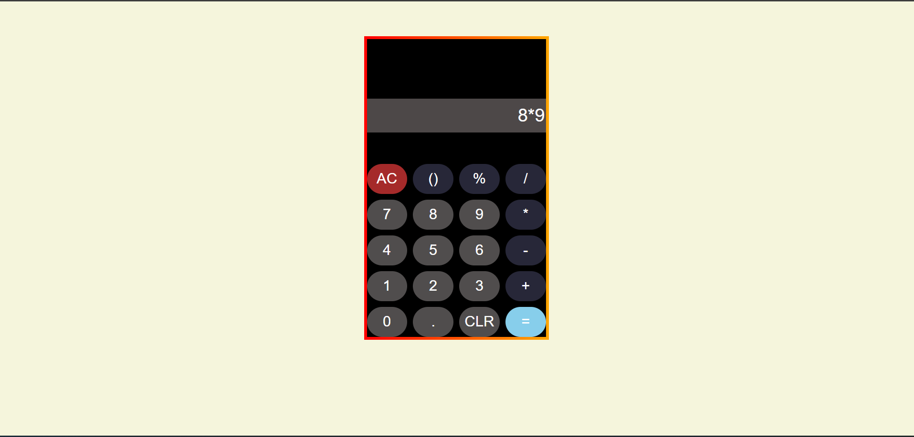

# 🧮 Calculator Clone

A simple **Calculator Web Application** built using **HTML, CSS, and JavaScript**.  
It performs basic arithmetic operations with a clean and responsive user interface.

---

## 🚀 Live Demo

(Enable GitHub Pages to add the link here)

Example:
https://yashaswinikaranam.github.io/calculator-clone/

---

## ✨ Features

- Basic arithmetic operations (+, −, ×, ÷)
- Clear and delete functionality
- Responsive calculator layout
- Keyboard-like button interaction
- Simple and clean UI

---

## 🛠️ Tech Stack

- **HTML** – Structure of the calculator
- **CSS** – Styling and layout
- **JavaScript** – Calculator logic and operations

---

## 📂 Project Structure

```
calculator-clone
│
├── index.html
├── style.css
├── script.js
└── README.md
```

---

## ▶️ How to Run Locally

1. Clone the repository

```
git clone https://github.com/yashaswinikaranam/calculator-clone.git
```

2. Open the folder

```
calculator-clone
```

3. Open **index.html** in your browser.

---

## 📸 Screenshot



---

## 📌 Future Improvements

- Add keyboard input support
- Scientific calculator functions
- Dark/light theme toggle
- Mobile optimization

---

## 👩‍💻 Author

**Yashaswini**

---

⭐ If you like this project, feel free to star the repository.
